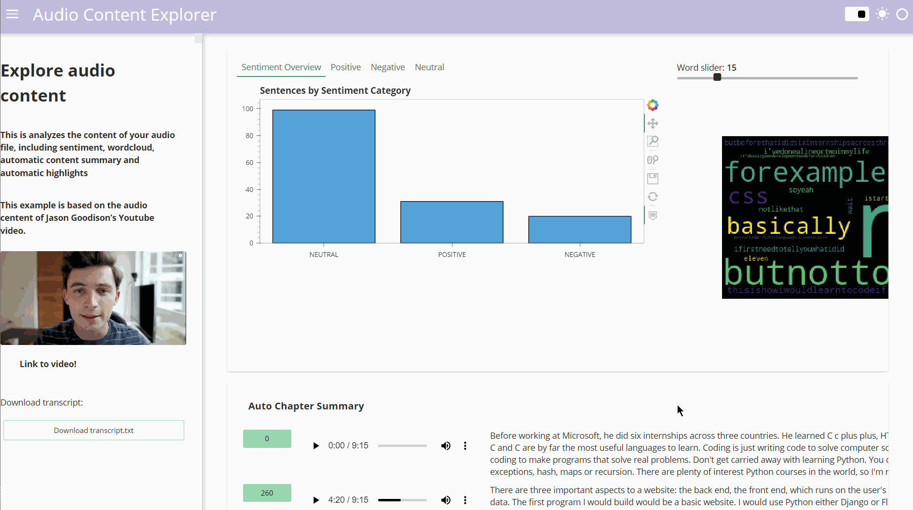

# Audio_Data_Explorer

This is a project about exploring the data in audio file using AssemblyAI API, guided by Thu Vu data analysis
https://www.assemblyai.com/docs/walkthroughs#uploading-local-files-for-transcription

## Running Guide

`git clone https://github.com/jacklvd/Audio_Data_Project.git`
`python -m venv venv`
`venv/scripts/activate`
`pip install -r requirements.txt`
`jupyter lab`

## Dashboard Walkthrough

